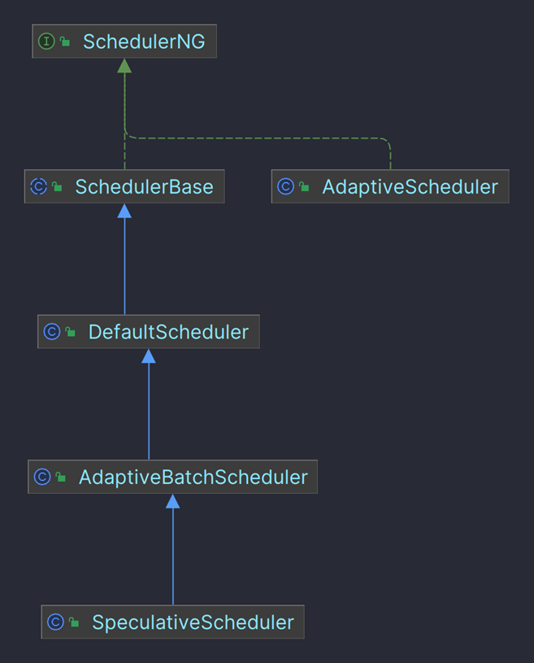

# Flink 简介

## Flink 主要功能

Apache Flink 是一个流处理框架，用于处理和分析实时数据流和批处理数据。它提供了一种可扩展、容错、高吞吐量和低延迟的数据处理方式。

## Flink 设计思想

### DataFlow

DataFlow 是 Google 提出的编程模型，其提供了一种统一批处理和流处理的系统。


想要详细了解 DataFlow，可以阅读Google的论文[https://dl.acm.org/doi/10.14778/2824032.2824076](https://dl.acm.org/doi/10.14778/2824032.2824076)


生产生活中的数据本身就是流式了。在分析数据的时候可以将数据视为有界流和无界流。

<figure><figcaption>
有界数据流与无界数据流
</figcaption></figure>

**批处理**是有界数据流处理的范例。在这种模式下，你可以选择在计算结果输出之前输入整个数据集，这也就意味着你可以对整个数据集的数据进行排序、统计或汇总计算后再输出结果。

**流处理**正相反，其涉及无界数据流。至少理论上来说，它的数据输入永远不会结束，因此程序必须持续不断地对到达的数据进行处理。

但是，在现实场景中，无界数据流可以通过批处理系统反复调度来处理，而设计良好的流处理系统也可以完美地处理有界数据流。因此，从这个角度来看，区分批处理和流处理意义不大。

### 窗口计算

DataFlow 提供了三种窗口计算类型。窗口可以把一个数据集切分为有限的数据片，方便聚合处理。

1. 固定窗口：固定窗口时间
2. 滑动窗口：固定窗口时间，同时有一个滑动周期
3. 会话窗口：定义超时时间，任何发生在超时时间以内的事件被认为属于同一个会话。

### 时间域和水位线机制

将时间域分为两种，事件时间是事件发生时的系统时间；处理时间是系统观察到事件的时间。

<figure><figcaption>
事件时间与处理时间关系图
</figcaption></figure>

借助水位线机制可以有效处理迟到的乱序事件，得到正确的数据处理结果。

### 分布式异步快照算法

Flink中通过 checkpoint 机制保证数据一致性，checkpoint 机制通过 Chandy-Lamport 算法实现，其通过抽象分布式系统模型描述了一种简单、直接但是非常有效的分布式快照算法。

## Flink 整体架构

### Flink 架构介绍

Flink系统架构主要分为APIs & Libraries、Core 和Deploy三层。

<figure><figcaption>
Flink整体架构
</figcaption></figure>

API 层实现了面向批处理的 DataSet API 和面向流处理的 DataStream API 。在此之上构建了面向特定领域的Libraries。面向批处理支持 CEP（复杂事件处理）、Table（类似SQL的操作）。面向流处理支持Table（类似SQL的操作）、Graph（图处理）、Flink ML（机器学习库）。Runtime 层提供 Flink 计算的全部核心实现。Deploy 层支持多种部署模式。

### Flink 集群架构

Flink 集群架构如下图所示。

<figure><figcaption>
Flink集群架构图
</figcaption></figure>

Client 将数据准备并发送给 JobManager。

JobManager 具有许多与协调 Flink 应用程序的分布式执行有关的职责：它决定何时调度下一个 task（或一组 task）、对完成的 task 或执行失败做出反应、协调 checkpoint、并且协调从失败中恢复等等。

TaskManager（也称为 worker）执行作业流的 task，并且缓存和交换数据流。

