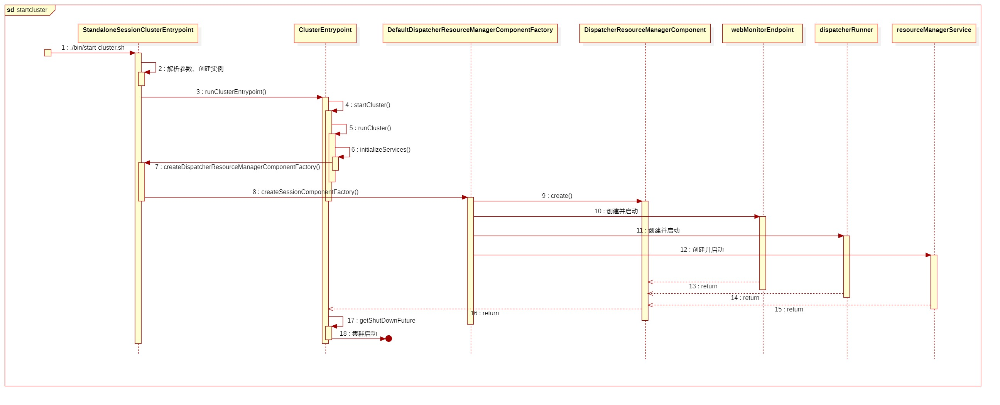
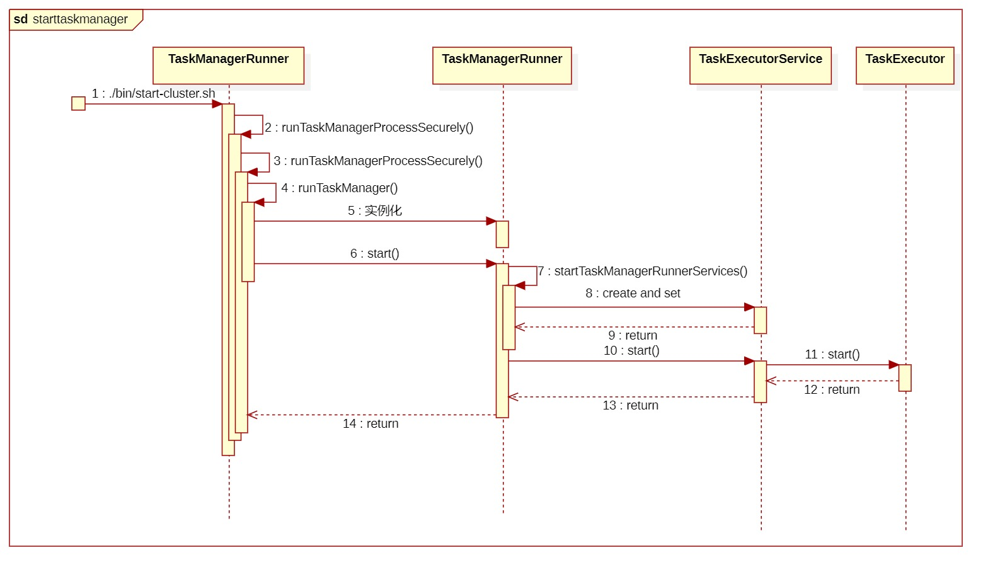
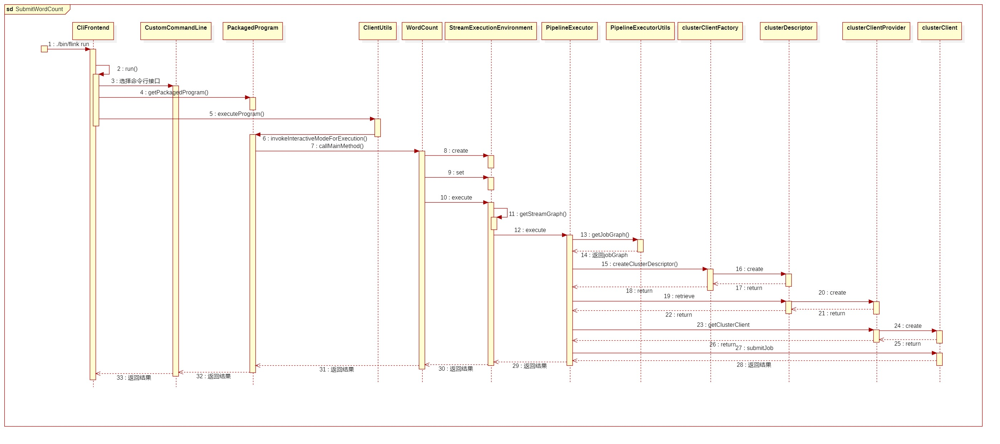

# Flink 流程

笔者以单机模式在本地部署 Flink，提交 Flink 官方给出的例子 WordCount.jar

## 流程示意图

<figure><figcaption></figcaption></figure>

## Flink 集群启动

运行以下命令就可以以单机模式在本地部署 Flink

```bash
$ ./bin/start-cluster.sh
Starting cluster.
Starting standalonesession daemon on host LAPTOP-XIAOXIN-KONJAC.
Starting taskexecutor daemon on host LAPTOP-XIAOXIN-KONJAC.
```

此时可以通过访问 `localhost:8081` 查看 Flink 的 webUI

<figure><figcaption><p>flink webUI</p></figcaption></figure>

在 `start-cluster.sh` 中依次运行了两个类的 `main` 方法

1. `org.apache.flink.runtime.entrypoint.StandaloneSessionClusterEntrypoint`
2. `org.apache.flink.runtime.taskexecutor.TaskManagerRunner`

接下来将依次介绍流程。

### 集群组件的创建和启动

#### 流程时序图

<figure><figcaption><p>集群启动时序图</p></figcaption></figure>

#### 程序入口

对应时序图中步骤 1

1. `start-cluster.sh` 运行了 `org.apache.flink.runtime.entrypoint.StandaloneSessionClusterEntrypoint`

#### 环境准备

对应时序图中步骤 2-6

1. 解析参数，创建并调用 `ClusterEntrypoint`中`runClusterEntrypoint()` 方法继续执行
2. 调用 `initializeServices()` 初始化服务

#### 集群组件创建

对应时序图中步骤 7-16

1. 创建并调用 `DefaultDispatcherResourceManagerComponentFactory`的`create()` 方法
2. 创建并运行 `webMonitorEndpoint`、`dispatcherRunner` 和 `resourceManagerService`，并集合为 `DispatcherResourceManagerComponent`

#### 集群启动

对应时序图中步骤 17-18

1. 调用 `DispatcherResourceManagerComponent` 的 `getShutDownFuture` 启动集群

### TaskManager 的创建与启动

#### 流程时序图

<figure><figcaption><p>TaskManager启动时序图</p></figcaption></figure>

#### 程序入口

对应时序图中步骤 1

1. `start-cluster.sh` 运行了 `org.apache.flink.runtime.taskexecutor.TaskManagerRunner`

#### 环境准备

对应时序图中步骤 2-4

1. 解析参数，加载插件
2. 调用 `runTaskManager()` 继续创建

#### TaskManager创建

对应时序图中步骤 5-14

1. 实例化 `TaskManagerRunner` 并调用其 `start()` 方法
2. `TaskManagerRunner` 调用自身 `startTaskManagerRunnerServices()` 方法创建 `TaskExecutorService`
3. 调用 `TaskExecutorService` 的 `start()` 方法，其中启动了 `TaskExecutor`

## WorldCount


```java
public class WordCount {

    // *************************************************************************
    // PROGRAM
    // *************************************************************************

    public static void main(String[] args) throws Exception {
        final CLI params = CLI.fromArgs(args);

        // Create the execution environment. This is the main entrypoint
        // to building a Flink application.
        final StreamExecutionEnvironment env = StreamExecutionEnvironment.getExecutionEnvironment();

        // Apache Flink’s unified approach to stream and batch processing means that a DataStream
        // application executed over bounded input will produce the same final results regardless
        // of the configured execution mode. It is important to note what final means here: a job
        // executing in STREAMING mode might produce incremental updates (think upserts in
        // a database) while in BATCH mode, it would only produce one final result at the end. The
        // final result will be the same if interpreted correctly, but getting there can be
        // different.
        //
        // The “classic” execution behavior of the DataStream API is called STREAMING execution
        // mode. Applications should use streaming execution for unbounded jobs that require
        // continuous incremental processing and are expected to stay online indefinitely.
        //
        // By enabling BATCH execution, we allow Flink to apply additional optimizations that we
        // can only do when we know that our input is bounded. For example, different
        // join/aggregation strategies can be used, in addition to a different shuffle
        // implementation that allows more efficient task scheduling and failure recovery behavior.
        //
        // By setting the runtime mode to AUTOMATIC, Flink will choose BATCH if all sources
        // are bounded and otherwise STREAMING.
        env.setRuntimeMode(params.getExecutionMode());

        // This optional step makes the input parameters
        // available in the Flink UI.
        env.getConfig().setGlobalJobParameters(params);

        DataStream<String> text;
        if (params.getInputs().isPresent()) {
            // Create a new file source that will read files from a given set of directories.
            // Each file will be processed as plain text and split based on newlines.
            FileSource.FileSourceBuilder<String> builder =
                    FileSource.forRecordStreamFormat(
                            new TextLineInputFormat(), params.getInputs().get());

            // If a discovery interval is provided, the source will
            // continuously watch the given directories for new files.
            params.getDiscoveryInterval().ifPresent(builder::monitorContinuously);

            text = env.fromSource(builder.build(), WatermarkStrategy.noWatermarks(), "file-input");
        } else {
            text = env.fromElements(WordCountData.WORDS).name("in-memory-input");
        }

        DataStream<Tuple2<String, Integer>> counts =
                // The text lines read from the source are split into words
                // using a user-defined function. The tokenizer, implemented below,
                // will output each word as a (2-tuple) containing (word, 1)
                text.flatMap(new Tokenizer())
                        .name("tokenizer")
                        // keyBy groups tuples based on the "0" field, the word.
                        // Using a keyBy allows performing aggregations and other
                        // stateful transformations over data on a per-key basis.
                        // This is similar to a GROUP BY clause in a SQL query.
                        .keyBy(value -> value.f0)
                        // For each key, we perform a simple sum of the "1" field, the count.
                        // If the input data stream is bounded, sum will output a final count for
                        // each word. If it is unbounded, it will continuously output updates
                        // each time it sees a new instance of each word in the stream.
                        .sum(1)
                        .name("counter");

        if (params.getOutput().isPresent()) {
            // Given an output directory, Flink will write the results to a file
            // using a simple string encoding. In a production environment, this might
            // be something more structured like CSV, Avro, JSON, or Parquet.
            counts.sinkTo(
                            FileSink.<Tuple2<String, Integer>>forRowFormat(
                                            params.getOutput().get(), new SimpleStringEncoder<>())
                                    .withRollingPolicy(
                                            DefaultRollingPolicy.builder()
                                                    .withMaxPartSize(MemorySize.ofMebiBytes(1))
                                                    .withRolloverInterval(Duration.ofSeconds(10))
                                                    .build())
                                    .build())
                    .name("file-sink");
        } else {
            counts.print().name("print-sink");
        }

        // Apache Flink applications are composed lazily. Calling execute
        // submits the Job and begins processing.
        env.execute("WordCount");
    }

    // *************************************************************************
    // USER FUNCTIONS
    // *************************************************************************

    /**
     * Implements the string tokenizer that splits sentences into words as a user-defined
     * FlatMapFunction. The function takes a line (String) and splits it into multiple pairs in the
     * form of "(word,1)" ({@code Tuple2<String, Integer>}).
     */
    public static final class Tokenizer
            implements FlatMapFunction<String, Tuple2<String, Integer>> {

        @Override
        public void flatMap(String value, Collector<Tuple2<String, Integer>> out) {
            // normalize and split the line
            String[] tokens = value.toLowerCase().split("\\W+");

            // emit the pairs
            for (String token : tokens) {
                if (token.length() > 0) {
                    out.collect(new Tuple2<>(token, 1));
                }
            }
        }
    }
}
```


上面的代码是 WordCount 的源代码。这里只讲解两个语句，在之后的提交流程中会有涉及。

第 12 行，实例化了一个流执行环境 `StreamExecutionEnvironment`

第 94 行，调用了流执行环境的 `execute()` 方法

## Flink 作业提交

执行以下命令将 WorldCount 提交

```bash
$ ./bin/flink run examples/streaming/WordCount.jar
Job has been submitted with JobID c35dca1d97498807a1e0e17f1f1cedfa
Program execution finished
Job with JobID c35dca1d97498807a1e0e17f1f1cedfa has finished.
Job Runtime: 601 ms
```

### 流程时序图

<figure><figcaption><p>提交流程时序图</p></figcaption></figure>

### 程序入口

对应时序图中步骤 1，在 `./bin/flink` 中执行了以下命令

```bash
exec "${JAVA_RUN}" $JVM_ARGS $FLINK_ENV_JAVA_OPTS "${log_setting[@]}" -classpath "`manglePathList "$CC_CLASSPATH:$INTERNAL_HADOOP_CLASSPATHS"`" org.apache.flink.client.cli.CliFrontend "$@"
```

其运行了 `org.apache.flink.client.cli.CliFrontend` 的main方法。

### 解析参数

对应时序图中步骤 2-4

1. 解析环境配置，选择命令行接口（Generic、Yarn、Default），在本例中为 Default
2. 调用命令行接口继续运行。
3. 命令行接口调用 `CliFrontendParser` 解析参数
4. 打包有效配置，创建 `PackagedProgram`

### 调用用户代码的main方法

对应时序图步骤 5-7

1. 调用 `ClientUtils` 运行程序
2. 设置执行环境上下文
3. 调用用户代码的 main 方法，本例子中为 WordCount 的 main 方法

### 调用执行环境的 execute 方法

对应时序图步骤 8-10

1. WordCount 实例化了一个流执行环境 `StreamExecutionEnvironment`
2. 在设置了执行环境后调用其 `execute` 方法

### 生成 jobGraph 和 clusterClient

对应时序图步骤 11-26

1. 流执行环境调用 `getStreamGraph` 得到 `streamGraph`
2. 选择并创建 `PipelineExecutor` 继续执行，在本例中为 `AbstractSessionClusterExecutor`
3. `PipelineExecutor` 调用 `PipelineExecutorUtils` 的 `getJobGraph` 方法得到 `jobGraph`
4. 通过工厂模式依次生成 `clusterDescriptor`、`clusterClientProvider`、`clusterClient`

### 提交任务并返回结果

对应时序图步骤 27-33

1. `clusterClient` 不断尝试提交任务到集群，并返回提交结果

至此，WordCount 被提交的了之前启动的集群上，并开始运行。

## Flink 作业运行

### 流程时序图

<figure><figcaption></figcaption></figure>

### 接收作业

对应时序图中步骤 1-8

1. `Dispatcher` 接收作业并且为作业创建一个 `JobMaster` 来管理其在集群上的运行

### JobMaster 启动

对应时序图中步骤 9-11

1. `JobMaster` 启动并运行作业，返回作业提交情况给 `Dispatcher` ，`Dispatcher` 将作业提交情况返回给客户端。
